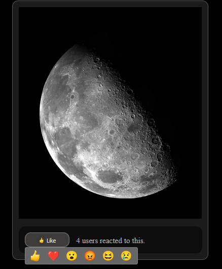

# Reaction_button_system_bycesar525_likebutton
Modern Reaction button System for Forum and Contents

# Programing L used
* HTML / CSS
* JAVASCRIPT
* PHP version: 7.2.34 (Not tested on version 8) If there is any issue on PHP version 8 then post it on issues.

# INSTALLING PROCEDURES
* Upload the database SQL file called "sql_schema_likes.sql" located: inside cesar525_likeButton/engine/ to your database
* Go to Cesar525_likeButton/config.php and fill up the database info to access your database
* Go to the installing.php file and do the same thing i did in order to add the like button.
it explains you what to do.
## Important files to pass.
     * cesar525_likebutton folder
     * likes_api.php
in order for the button to work. The rest is just examples ECT for you to learn how to install it..
The installing.php give you a better example on how to install it.

# Images

# Dev
Contact and Support me at my Website [Dev Let's Work Together](https://devletswork.com/)
## License
* 
